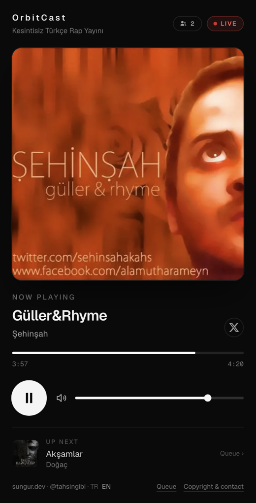
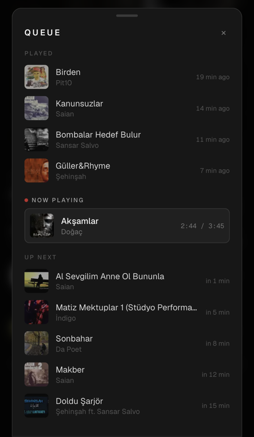
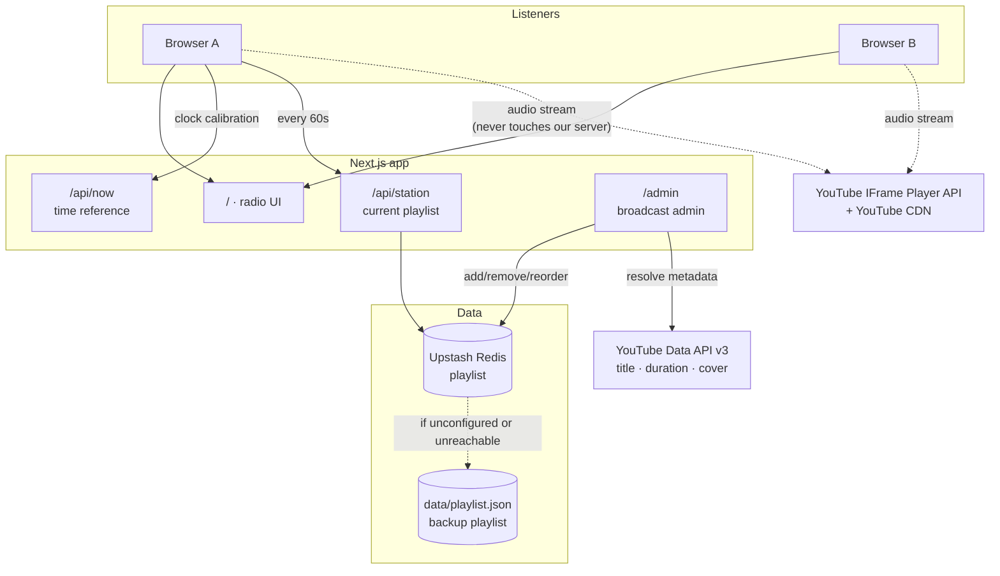
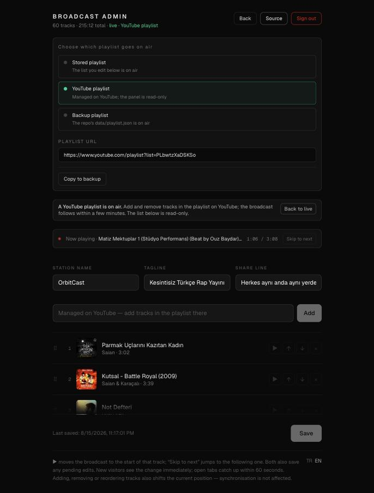

# OrbitCast

**Türkçe:** [README.tr.md](README.tr.md)

Run your own internet radio — without your server streaming a single byte of audio.

The YouTube tracks you pick play in order. Everyone who opens the site lands on
**the same second of the same track**. When the list ends it loops, forever.
Nobody can seek, skip or restart — it behaves like a real radio, down to the
badge showing how many people are listening with you right now.

[](https://nextjs.org)
[](https://www.typescriptlang.org)
[](https://upstash.com)
[](https://vercel.com)
[](LICENSE)
[](https://github.com/tahsingibi/orbitcast)

<p align="center">
  
  
</p>

**Why this architecture?** No audio file is ever downloaded, stored or
re-broadcast. Playback happens through the official YouTube IFrame Player API,
on YouTube's own infrastructure. Two consequences follow: you stay on the right
side of copyright, and **your bandwidth cost is zero** — 10 listeners and
10,000 listeners both download exactly nothing from your server.

---

## Contents

- [How it works](#how-it-works)
- [Quick start](#quick-start)
- [Where the playlist lives](#where-the-playlist-lives)
- [Make it yours](#make-it-yours)
- [Languages](#languages)
- [Environment variables](#environment-variables)
- [Deploying to Vercel](#deploying-to-vercel)
- [Managing the playlist](#managing-the-playlist)
- [Appearance and PWA](#appearance-and-pwa)
- [Under the hood](#under-the-hood)
- [FAQ and limits](#faq-and-limits)
- [Security note](#security-note)
- [Copyright](#copyright)
- [License](#license)
- [Credits](#credits)

---

## How it works

The server broadcasts nothing. It does not even _track_ what is playing. The
position is pure arithmetic:

```
total   = sum of all track durations
elapsed = (now − epoch) mod total
```

Walking `elapsed` across the track durations answers "which track, which
second". The inputs are identical for everyone, so the answer is too. The
modulo gives you the infinite loop for free — there is no "wrap around" logic
anywhere.



No database to run, no WebSocket, no cron job, no background process.

---

## Quick start

**Requirement:** Node.js **22.18+** (24 LTS recommended).

> Why that version? `npm run radio:sync` imports a TypeScript module directly, and
> Node supports that out of the box from 22.18. The app itself runs on 20.9+.

```bash
git clone https://github.com/tahsingibi/orbitcast.git my-radio
cd my-radio
npm install
npm run radio:setup
npm run dev
```

Open **http://localhost:3000**

`npm run radio:setup` asks for the station name, lets you pick where the playlist
comes from, writes `.env.local` and fills the first playlist. It is safe to run
again later — every question offers the current value, and blank answers keep
it.

If you would rather configure by hand, skip it: the app runs with no
environment variables at all, reading `data/playlist.json`. Add
`ADMIN_PASSWORD` to `.env.local` to unlock **http://localhost:3000/admin**
(without it the panel is fully disabled, not even a login screen).

### Testing from a phone

For safety, Next's dev server refuses to serve `/_next/*` resources to origins
it does not recognise. When you connect using your machine's name
(`http://mymachine.local:3000`) or its LAN IP, that block kicks in and **the
page loads but nothing works** — the HTML arrives, the client JS does not.

`.local` addresses (Bonjour/mDNS) are allowed out of the box. If you connect
over a LAN IP, add it:

```bash
# .env.local
ALLOWED_DEV_ORIGINS=192.168.1.7
```

Restart the dev server. This only affects development; production builds have
no such restriction.

---

## Where the playlist lives

Pick one. `npm run radio:setup` asks; `RADIO_SOURCE` records the answer.

| Source                   | Add a track by                      | Needs                   | Admin panel |
| ------------------------ | ----------------------------------- | ----------------------- | ----------- |
| **YouTube playlist**     | editing the playlist on YouTube     | nothing                 | read-only   |
| **Upstash Redis**        | `/admin` or `npm run radio:add`     | a free Upstash database | full        |
| **`data/playlist.json`** | `npm run radio:add`, then deploying | nothing                 | full        |

`RADIO_SOURCE` only sets the **starting** point. Once running, you switch from
`/admin` → **BROADCAST SOURCE**, paste a playlist URL there, or copy the live
list to the backup. The choice is stored with the playlist, so it survives
restarts and needs no redeploy. Every switch is validated first: an empty
backup, a missing URL or an unreadable playlist is refused rather than taking
the station off air.

### Broadcasting straight from YouTube

```bash
# .env.local
RADIO_SOURCE=youtube
YOUTUBE_PLAYLIST_URL=https://www.youtube.com/playlist?list=PL...
```

No panel, no database. The list is re-read every `RADIO_PLAYLIST_TTL_SEC`
seconds (default 300), so a track you add on YouTube is on air within five
minutes. Titles, artists, durations and covers all come from the playlist page
in **one HTTP request** — no per-track lookups, no API key required, though
without `YOUTUBE_API_KEY` only the first ~100 tracks are visible. The list must
be public or unlisted; private, live and non-embeddable videos are skipped
rather than breaking the broadcast.

### Local audio files

If you own the recordings, serve them directly instead of embedding YouTube:

```bash
npm run radio:add        # 3) Add local audio files (scan a folder)
```

Files are copied into `public/audio/` and deploy with the repo. Title, artist
and cover come from the ID3 tags where present; duration is parsed from the MP3
frames to the millisecond, because synchronisation depends on it. `.m4a`,
`.ogg`, `.wav` and `.flac` work if `ffprobe` is installed. Local files are not a
separate mode — they are tracks with `kind: "audio"` and can sit in the same
playlist as YouTube tracks.

> **This one is on you.** Everything else streams from YouTube's CDN: your
> server sends no audio at all, and playback happens under YouTube's terms.
> Local files are the opposite — the bandwidth is yours to pay for and the
> licensing is yours to hold.

### The role of `data/playlist.json`

It is never unused. Whichever source you pick, it holds the station identity
(name, tagline, `epoch`), seeds Redis on the first read, and stands in as the
**backup playlist** when the live source is unreachable.

`npm run radio:add` keeps it in step: every write goes to the live store *and*
mirrors into this file, so the backup you commit matches what is on air rather
than lagging months behind. The mirror deliberately drops the source selection —
a backup that pointed somewhere else would send a fallback straight back out
again.

Edits made in `/admin` cannot do this: the panel runs on the server, where the
filesystem is read-only. Use **Copy to backup** in the source panel after a
session of panel edits, then commit.

---

## Make it yours

**Two things are mandatory** if you publish your fork.

1. **`src/lib/site.ts`** — the credit, social accounts, contact address and
   donation link. These ship as deliberate placeholders (`example.com`,
   `you@example.com`), never as anyone's real details, so a fork that never
   gets here publishes nothing but obviously-fake values instead of routing
   someone else's mail to a stranger. The one you must not skip is
   `contactEmail`: the About dialog points takedown requests at it, and rights
   holders will write there about **your** broadcast. `socials` is a list —
   add as many accounts as you like, or leave it empty and none are shown.
   `supportUrl` is empty by default; fill it and a donation button appears in
   the About dialog, leave it and the whole support section disappears.
2. **`LICENSE`** — MIT requires the copyright line to name the holder. Put your
   name and year there.

Then the optional parts:

3. **The playlist.** The repo ships empty; `npm run radio:setup` fills it. The
   identity fields carry neutral placeholders (`OrbitCast`, `Your own radio,
   from one playlist`) so nothing looks broken before you get to them. Keep the share line
   under ~45 characters or it wraps on the share card, and leave off the full
   stop — one is added when the description is composed.
4. **`epoch`** — the conceptual zero of the broadcast, in `data/playlist.json`.
   Everything is derived from it, so changing it shifts what everyone hears.
   Adding the first track to an empty list sets it automatically. Set it once,
   then leave it alone.
5. **Visual identity** — `public/icon-*.png` and `apple-touch-icon.png` for the
   icons, `src/app/globals.css` for colours, `package.json` `name` for the
   project itself.
6. **Responsibility.** You are the publisher. Playback runs through YouTube's
   own player under its terms, which is what keeps this clean — but the
   selection is yours, and so is answering for it.

## Languages

The interface ships in Turkish and English; every string lives in
`src/lib/i18n/dictionaries/`. To add a language, add its code to `LOCALES` in
`config.ts` and drop in a dictionary file — the `Dictionary` type is derived
from the Turkish one, so a missing key is a **compile error**.

The active language is the visitor's choice (cookie), then `Accept-Language`,
then the default. The switch sits in the footer of both the radio and `/admin`.
Station content — name, tagline, share line — is your data, not translated copy.

---

## Environment variables

Copy `.env.example` to `.env.local` and fill it in.

| Variable                   | Local    | Production               | What it does                                                                             |
| -------------------------- | -------- | ------------------------ | ---------------------------------------------------------------------------------------- |
| `ADMIN_PASSWORD`           | optional | **required**             | Password for `/admin`. Without it the panel is fully disabled (not even a login screen). |
| `RADIO_SOURCE`             | optional | optional                 | `youtube`, `redis` or `file`. Inferred from the variables below when unset.              |
| `YOUTUBE_PLAYLIST_URL`     | —        | required for `youtube`   | The playlist the station broadcasts.                                                     |
| `RADIO_PLAYLIST_TTL_SEC`   | optional | optional                 | How often the YouTube playlist is re-read. Default 300.                                  |
| `UPSTASH_REDIS_REST_URL`   | optional | required for `redis`     | Playlist store. Without it `data/playlist.json` is used.                                 |
| `UPSTASH_REDIS_REST_TOKEN` | optional | required for `redis`     | Comes with the above.                                                                    |
| `YOUTUBE_API_KEY`          | optional | **strongly recommended** | Resolves track metadata through the official API. See below.                             |
| `NEXT_PUBLIC_SITE_URL`     | optional | optional                 | Absolute base URL for share links and OpenGraph. Auto-detected on Vercel.                |
| `ALLOWED_DEV_ORIGINS`      | optional | —                        | Extra dev origins, e.g. a LAN IP. Development only.                                      |

### Why `YOUTUBE_API_KEY` matters

Metadata (title, artist, **duration**, cover) is resolved two ways:

1. **With a key** → YouTube Data API v3. One request, official, reliable.
   Quota is 10,000 units/day at 1 unit per track — effectively unlimited, free.
2. **Without a key** → oEmbed plus scraping the watch page. Flawless locally,
   but **data-centre IPs can hit bot checks**, so adding tracks may fail on
   Vercel.

Duration is the foundation of synchronisation and cannot be guessed; if it
cannot be read, the track is not added. Set a key in production.

**Getting a key:** [Google Cloud Console](https://console.cloud.google.com) →
new project → `APIs & Services` → enable `YouTube Data API v3` → `Credentials` →
`Create credentials` → `API key`. No credit card required.

---

## Deploying to Vercel

1. **Import the repo.** Next.js is detected automatically.

2. **Add Upstash Redis.** In Vercel: `Storage → Create Database → Upstash Redis`
   → connect it to the project. `UPSTASH_REDIS_REST_URL` and
   `UPSTASH_REDIS_REST_TOKEN` are **added automatically**.

3. **Add the rest.** `Settings → Environment Variables`: `ADMIN_PASSWORD`
   (generate something strong) and `YOUTUBE_API_KEY`.

4. **Deploy.** On first boot, if Redis is empty, `data/playlist.json` is written
   in as the **seed**. From then on all edits happen through `/admin`.

> ### ⚠️ The trap everyone hits
>
> Once Redis has been seeded, **`data/playlist.json` is no longer read.**
> Editing the file and redeploying changes nothing in production.
>
> The way to change the playlist in production is the `/admin` panel.
>
> To re-seed from the file: Upstash console → `Data Browser` → delete the
> `radio:playlist` key → reload the site.

---

## Managing the playlist

### The `/admin` panel

<p align="center">
  
</p>


Password-protected by `ADMIN_PASSWORD`; without it the panel is fully disabled.
Paste a YouTube link and press **Add** — title, artist, duration and cover are
resolved for you. Drag to reorder, edit the station identity, save.

Listeners pick the change up within a minute. **Adding, removing or reordering
does not shift the broadcast position** — synchronisation is unaffected.

Two controls change what is on air rather than what is in the list:

- **▶ on a track** — pulls the broadcast to the start of that track, for everyone.
- **BROADCAST SOURCE** — switches between the stored playlist, a YouTube
  playlist and the backup list, and copies the live list to the backup.

### Adding tracks

```bash
npm run radio:add
```

```
  1) Add tracks (one or many links)
  2) Import a YouTube playlist
  3) Add local audio files (scan a folder)
  4) Edit station details
  5) Show the list
  6) Remove tracks
```

It resolves every link, skips duplicates and non-embeddable videos, and writes
to **whichever store is live** — the `store:` line in the header tells you
which. Single links and playlist links are both accepted automatically.
Importing a playlist asks whether to append or replace; `6` accepts `all` to
clear the list.

For scripts and pipes:

```bash
npm run radio:add -- "https://youtu.be/VIDEO_ID"
npm run radio:add -- "https://www.youtube.com/playlist?list=PLAYLIST_ID"
```

`npm run radio:sync` re-fetches metadata for entries you edited by hand.
`durationSec` is always refreshed because synchronisation depends on it; titles
and artists you edited survive unless you pass `--force`.

## Appearance and PWA

The interface is one file, `src/components/RadioPlayer.tsx`, in Tailwind classes
with no separate theme layer. Colours are the `neutral-*` and `red-*` classes,
the font is set in `src/app/layout.tsx`, all copy is in
`src/lib/i18n/dictionaries/`, and the share cards are the `opengraph-image.tsx`
routes. The UI is pinned to dark in `globals.css`.

The app installs as a PWA — the manifest is generated by `src/app/manifest.ts`
and picks up your station name; swap `public/icon-*.png` for your own. The
service worker deliberately caches only immutable files under `/_next/static/`;
pages and `/api/*` always hit the network, or a stale playlist would break
synchronisation.

> **A PWA does not enable background playback.** When you background the browser
> on a phone the music stops, and that is normal. Embedded YouTube players block
> background playback by design (it is a Premium feature) and a manifest does not
> change media policy. The only way around it would be serving the audio
> yourself — which this project deliberately does not do.

---

## Under the hood

The whole system rests on one line of maths in `src/lib/radio.ts`:

```
elapsed = (now − epoch) mod totalDuration
```

Everything else follows from it. Nobody stores "what is playing" — every client
derives it, so a listener joining at any moment lands on the same second as
everyone else, and the modulo gives the infinite loop for free.

- **Clock.** The page ships with the server's timestamp as an anchor.
  `/api/now` is sampled three times, the lowest round-trip wins, and half the
  RTT is compensated. Progress runs on `performance.now()`, so changing the
  system clock cannot break it. Re-aligned every 5 minutes and whenever the tab
  becomes visible.
- **Drift.** Every 500 ms the player's position is compared with the computed
  one; past 2 seconds of drift it seeks. `onEnded` is only an accelerator, never
  the source of truth.
- **Ad breaks.** The IFrame API exposes no ad event, so they are inferred from
  the player reporting a duration that is not the track's. While one is running
  the listener is told and drift correction stands down; when it ends the player
  is pulled back to the live position in one move.
- **Sharing.** `/` gets the station card; `/p/[videoId]` gets a per-track card,
  because X caches OpenGraph images per URL and a single address would freeze on
  whichever track was scraped first. Instagram needs a different shape entirely —
  a story takes an image, not a link — so `/p/[videoId]/story` renders a
  1080×1920 card that the share menu hands to the device's share sheet via
  `navigator.share`. Where that is unavailable (most desktops) the card opens in
  a tab to be saved.
- **Layout.** The page is locked to the viewport and never scrolls; only the
  queue sheet and the admin track list scroll, inside `flex-1 min-h-0` boxes.

Tunable constants live at the top of the file that uses them — `TICK_MS`,
`DRIFT_TOLERANCE_SEC` and `SETTLE_MS` in `RadioPlayer.tsx`, `CACHE_TTL_MS` in
`station.ts`, `BUCKET_SEC` in `presence.ts`. The code is commented; start at
`src/lib/radio.ts`.

---

## FAQ and limits

**A track is silent / "could not be played".** The video is non-embeddable,
removed or region-locked. The broadcast recovers on the next track; remove it in
`/admin` and add another upload.

**Adding a track fails on Vercel.** Almost certainly a missing
`YOUTUBE_API_KEY` — data-centre IPs hit YouTube's bot checks.

**My change is not showing up.** Did you press Save? The server cache is 60
seconds and open tabs poll every 60 seconds.

**Editing `data/playlist.json` does nothing in production.** In Redis mode that
file is only the backup list. Edit through `/admin`.

**How many listeners can it take?** Effectively unlimited — audio comes from
YouTube's CDN, not your server. Your only limits are Vercel's page-render quota
and the Upstash command budget.

**Can I shuffle?** Not by design. Everyone must be on the same track at the same
second, so the order is fixed. Reorder it in `/admin` whenever you like.

| Limit                 | Behaviour                                                                                                                                       |
| --------------------- | ----------------------------------------------------------------------------------------------------------------------------------------------- |
| **YouTube ads**       | Detected (the player reports the ad's duration, not the track's) and shown to the listener; drift correction pauses until it ends, then resyncs once. The ad itself cannot be skipped or silenced — that is what pays the rights holders. |
| **Autoplay**          | Browsers require one press of play.                                                                                                             |
| **Mobile background** | Playback stops when the browser is backgrounded — a limitation of the embedded YouTube player that no web technique, PWA included, gets around. |
| **Touch reordering**  | Drag uses native HTML5 DnD, which mobile browsers do not support. Use `↑` `↓`.                                                                  |
| **Precision**         | Usually under a second apart; a few seconds at worst, given the 2-second drift tolerance.                                                       |
| **One station**       | One deployment broadcasts one radio.                                                                                                            |

## Security note

The repository is open source, so **everyone knows the `/admin` path**. The only
protection is `ADMIN_PASSWORD`.

- Use a long random password (e.g. `openssl rand -base64 24`)
- Never commit it — `.env.local` is already in `.gitignore`
- The session is signed with a key derived from the password itself, so changing
  the password invalidates every open session immediately
- Failed attempts are delayed by 600 ms but there is **no rate limiting**. If you
  expect to be targeted, put Vercel WAF or Cloudflare in front
- `/admin` is marked `robots: noindex`

---

## Copyright

This application **hosts, downloads, copies and re-broadcasts nothing**. Content
plays directly through YouTube's own player and infrastructure, exactly as the
rights holders published it there. [YouTube's Terms of
Service](https://www.youtube.com/t/terms) apply during playback.

The site carries a contact address for rights holders to send takedown requests
— **you must replace it with your own** in `src/lib/site.ts`.

You are responsible for the content of the radio you run.

---

## License

The **source code** of this project is MIT licensed — see [LICENSE](LICENSE).

The licence covers only the software in this repository, not the music that is
broadcast. Rights to the tracks belong to their respective artists and rights
holders.

---

## Credits

[sungur.dev](https://sungur.dev) · [@tahsingibi](https://x.com/tahsingibi)

If OrbitCast saved you an afternoon, you can
[buy me a coffee](https://buymeacoffee.com/tahsingibi). It supports the work of
keeping this open and maintained so anyone can run their own radio — never the
broadcast itself. The project stays MIT either way.
