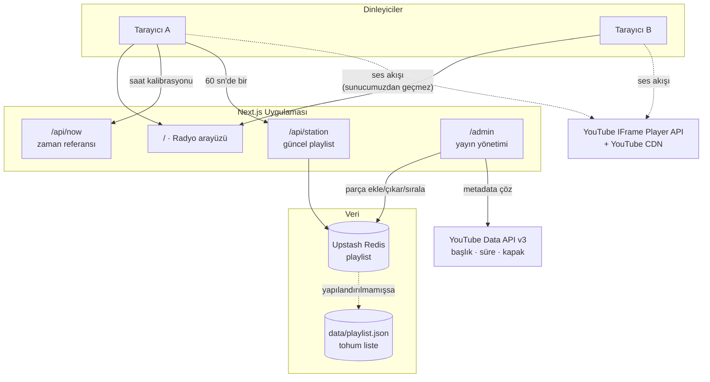

# OrbitCast

**English:** [README.md](README.md)

Kendi internet radyonu kur — sunucu ses yayınlamadan.

Seçtiğin YouTube parçaları sırayla çalar. Siteye giren herkes o an yayında olan
parçanın **aynı saniyesinden** dinlemeye başlar. Liste bitince başa döner ve
sonsuza kadar sürer. Kimse ileri/geri saramaz, kimse baştan başlatamaz —
gerçek bir radyo gibi davranır; şu an kaç kişinin seninle birlikte dinlediğini
gösteren rozete kadar.

[](https://nextjs.org)
[](https://www.typescriptlang.org)
[](https://upstash.com)
[](https://vercel.com)
[](LICENSE)
[](https://github.com/tahsingibi/orbitcast)

<p align="center">
  
  
</p>

**Neden bu mimari?** Ses dosyaları indirilmez, sunucuda tutulmaz, yeniden
yayınlanmaz. Oynatma resmî YouTube IFrame Player API ile, YouTube'un kendi
altyapısı üzerinden yapılır. Bunun iki büyük sonucu var: telif açısından
temizsin ve **bant genişliği maliyetin sıfır** — 10 dinleyici de 10.000
dinleyici de senin sunucundan tek bayt ses indirmez.

---

## İçindekiler

- [Nasıl çalışıyor?](#nasıl-çalışıyor)
- [Hızlı başlangıç](#hızlı-başlangıç)
- [Playlist nerede duruyor?](#playlist-nerede-duruyor)
- [Kendi radyonu kur](#kendi-radyonu-kur)
- [Diller](#diller)
- [Ortam değişkenleri](#ortam-değişkenleri)
- [Vercel'e deploy](#vercele-deploy)
- [Playlist yönetimi](#playlist-yönetimi)
- [Görünüm ve PWA](#görünüm-ve-pwa)
- [Kapağın altında](#kapağın-altında)
- [SSS ve sınırlar](#sss-ve-sınırlar)
- [Güvenlik notu](#güvenlik-notu)
- [Telif](#telif)
- [Lisans](#lisans)
- [Künye](#künye)

---

## Nasıl çalışıyor?

Sunucu müzik yayınlamaz, hatta neyin çaldığını "takip" bile etmez. Yayın
konumu saf matematikle bulunur:

```
total   = tüm parçaların süresi toplamı
elapsed = (şimdi − epoch) mod total
```

`elapsed` değeri parça süreleri boyunca gezilerek "kaçıncı parça, kaçıncı
saniye" sorusuna çevrilir. Girdiler herkeste aynı olduğu için sonuç da aynıdır.
Modulo sayesinde liste bitince başa döner — ayrı bir "başa sar" mantığı yoktur.



Veritabanı yönetmene, WebSocket kurmana, cron işi ya da arka plan süreci
çalıştırmana gerek yok.

---

## Hızlı başlangıç

**Gereksinim:** Node.js **22.18+** (24 LTS önerilir).

> Neden bu sürüm? `npm run radio:sync` script'i bir TypeScript modülünü doğrudan
> import ediyor; Node bunu 22.18'den itibaren varsayılan olarak destekliyor.
> Uygulamanın kendisi Node 20.9+ ile de çalışır.

```bash
git clone https://github.com/tahsingibi/orbitcast.git benim-radyom
cd benim-radyom
npm install
npm run radio:setup
npm run dev
```

Aç: **http://localhost:3000**

`npm run radio:setup` istasyon adını sorar, playlist'in nereden okunacağını seçtirir,
`.env.local` dosyasını yazar ve ilk listeyi doldurur. Sonradan tekrar
çalıştırmak güvenlidir: her soru mevcut değeri gösterir, boş bırakılırsa
değiştirmez.

Elle ayarlamayı tercih ediyorsan atla: uygulama hiçbir ortam değişkeni olmadan,
`data/playlist.json` dosyasını okuyarak çalışır. `.env.local` dosyasına
`ADMIN_PASSWORD` eklersen **http://localhost:3000/admin** açılır (o değişken
yoksa panel tamamen kapalıdır, giriş ekranı bile çıkmaz).

### Telefondan test etme

Next'in dev sunucusu, güvenlik gereği `/_next/*` kaynaklarını tanımadığı
origin'lere vermez. Bilgisayarınızın adıyla (`http://makinem.local:3000`) veya
LAN IP'siyle bağlandığınızda bu engel devreye girer ve **sayfa açılır ama
hiçbir şey çalışmaz** — HTML sunucudan gelir, istemci JS'i yüklenmez.

`.local` adresleri (`makinem.local`, Bonjour/mDNS) hazır olarak izinli. LAN
IP'si üzerinden bağlanacaksanız adresi ekleyin:

```bash
# .env.local
ALLOWED_DEV_ORIGINS=192.168.1.7
```

Dev sunucusunu yeniden başlatın. Bu ayar yalnızca geliştirmeyi etkiler;
üretim derlemesinde böyle bir kısıt yoktur.

---

## Playlist nerede duruyor?

Birini seç. `npm run radio:setup` soruyor; cevap `RADIO_SOURCE` değişkenine yazılıyor.

| Kaynak                   | Şarkı eklemek için                | Gereken                         | Yönetim paneli |
| ------------------------ | --------------------------------- | ------------------------------- | -------------- |
| **YouTube playlist**     | YouTube'daki listeyi düzenlemek   | hiçbir şey                      | salt okunur    |
| **Upstash Redis**        | `/admin` veya `npm run radio:add` | ücretsiz bir Upstash veritabanı | tam            |
| **`data/playlist.json`** | `npm run radio:add`, sonra deploy | hiçbir şey                      | tam            |

`RADIO_SOURCE` yalnızca **başlangıç** noktasını belirler. Uygulama çalışırken
kaynağı `/admin` → **YAYIN KAYNAĞI** bölümünden değiştirir, playlist adresini
oraya yapıştırır ya da canlı listeyi yedeğe kopyalarsın. Seçim playlist ile
birlikte saklandığı için yeniden başlatmaya da deploy almaya da gerek kalmaz.
Her geçiş önce doğrulanır: boş bir yedek, adresi olmayan ya da okunamayan bir
playlist yayını susturmak yerine reddedilir.

### Doğrudan YouTube'dan yayın

```bash
# .env.local
RADIO_SOURCE=youtube
YOUTUBE_PLAYLIST_URL=https://www.youtube.com/playlist?list=PL...
```

Panel yok, veritabanı yok. Liste `RADIO_PLAYLIST_TTL_SEC` saniyede bir yeniden
okunur (varsayılan 300), yani YouTube'da eklediğin parça beş dakika içinde
yayına girer. Başlık, sanatçı, süre ve kapak playlist sayfasından **tek bir HTTP
isteğiyle** gelir — parça başına sorgu yok, API anahtarı da şart değil; ama
`YOUTUBE_API_KEY` olmadan yalnızca ilk ~100 parça görünür. Listenin herkese açık
ya da "bağlantıya sahip olanlar" olması gerekir; gizli, canlı ve gömülmeye
kapalı videolar yayını bozmak yerine atlanır.

### Yerel ses dosyaları

Kayıtlar senin ise, YouTube gömmek yerine doğrudan yayınlayabilirsin:

```bash
npm run radio:add        # 3) Yerel ses dosyalarını ekle (klasör tara)
```

Dosyalar `public/audio/` altına kopyalanır ve repoyla birlikte deploy edilir.
Başlık, sanatçı ve kapak varsa ID3 etiketlerinden gelir; süre ise MP3
karelerinden milisaniye hassasiyetiyle çıkarılır, çünkü senkron ona dayanıyor.
`ffprobe` kuruluysa `.m4a`, `.ogg`, `.wav` ve `.flac` de çalışır. Yerel dosyalar
ayrı bir mod değil — `kind: "audio"` taşıyan parçalar; YouTube parçalarıyla aynı
listede durabilirler.

> **Bunun sorumluluğu sende.** Geri kalan her şey YouTube'un CDN'inden akıyor:
> sunucun hiç ses göndermiyor ve oynatma YouTube'un şartları altında oluyor.
> Yerel dosyalar bunun tersi — bant genişliği faturası da lisans sorumluluğu da
> sana ait.

### `data/playlist.json`'un rolü

Hiçbir modda atıl kalmaz. Hangi kaynağı seçersen seç istasyon kimliğini (ad,
slogan, `epoch`) tutar, ilk okumada Redis'i tohumlar ve canlı kaynağa
ulaşılamadığında **yedek liste** olarak devreye girer.

`npm run radio:add` bu dosyayı da güncel tutuyor: her yazma hem canlı depoya
hem bu dosyaya gidiyor. Böylece commit'lediğin yedek, aylar öncesinin listesi
değil yayındakinin aynısı oluyor. Kopyalamada kaynak seçimi bilerek dışarıda
bırakılıyor — başka bir kaynağı işaret eden bir yedek, yayını yedekten tekrar
dışarı yönlendirirdi.

`/admin` üzerinden yapılan düzenlemeler bunu yapamaz: panel sunucuda çalışıyor
ve orada dosya sistemi salt okunur. Panelde çalıştıktan sonra kaynak
bölümündeki **Yedeğe kopyala** düğmesini kullanıp commit'le.

---

## Kendi radyonu kur

**İki şey zorunlu** — fork'unu yayınlayacaksan.

1. **`src/lib/site.ts`** — künye, sosyal hesaplar, iletişim adresi ve bağış
   bağlantısı. Bu alanlar bilerek sahte değerlerle geliyor (`example.com`,
   `you@example.com`), kimsenin gerçek bilgisiyle değil: buraya hiç gelmeyen
   bir fork yalnızca apaçık sahte değerler yayınlar, başkasının postasını
   yanlış gelen kutusuna yönlendirmez. Atlamaman gereken tek alan
   `contactEmail`: "Hakkında" penceresi kaldırma taleplerini oraya
   yönlendiriyor ve hak sahipleri **senin** yayının için oraya yazacak.
   `socials` bir liste — istediğin kadar hesap ekle, ya da boş bırak, o zaman
   hiçbiri görünmez. `supportUrl` varsayılan olarak boş; doldurursan
   "Hakkında" penceresinde bir bağış düğmesi çıkar, boş bırakırsan destek
   bölümü hiç görünmez.
2. **`LICENSE`** — MIT, telif satırında hak sahibinin adını şart koşuyor. Kendi
   adını ve yılı yaz.

Sonrası isteğe bağlı:

3. **Playlist.** Repo boş geliyor; `npm run radio:setup` dolduruyor. Kimlik
   alanlarında nötr placeholder'lar var (`OrbitCast`, `Your own radio, from one
   playlist`), sen sıra oraya gelmeden hiçbir şey bozuk görünmesin diye. Paylaşım metnini ~45
   karakterin altında tut, yoksa kartta ikinci satıra sarıyor; sonuna nokta
   koyma, açıklama kurulurken zaten ekleniyor.
4. **`epoch`** — yayının kavramsal sıfır noktası, `data/playlist.json` içinde.
   Her şey ondan türediği için değiştirmek herkesin duyduğunu kaydırır. Boş
   listeye ilk parça eklendiğinde kendiliğinden ayarlanıyor. Bir kez ayarla,
   sonra dokunma.
5. **Görsel kimlik** — ikonlar için `public/icon-*.png` ve
   `apple-touch-icon.png`, renkler için `src/app/globals.css`, projenin kendi
   adı için `package.json` içindeki `name`.
6. **Sorumluluk.** Yayıncı sensin. Oynatma, YouTube'un kendi oynatıcısında ve
   onun şartları altında gerçekleşiyor — projeyi temiz tutan şey bu. Ama seçim
   senin, hesabını vermek de sana ait.

## Diller

Arayüz Türkçe ve İngilizce geliyor; bütün metinler
`src/lib/i18n/dictionaries/` altında. Dil eklemek için kodunu `config.ts`
içindeki `LOCALES` listesine ekle ve bir sözlük dosyası bırak — `Dictionary`
tipi Türkçe sözlükten türediği için eksik anahtar **derleme hatası** verir.

Geçerli dil sırasıyla: ziyaretçinin seçimi (çerez), `Accept-Language`,
varsayılan. Değiştirici hem radyonun hem `/admin` panelinin altında. İstasyon
içeriği — ad, slogan, paylaşım metni — çeviri değil, senin verin.

---

## Ortam değişkenleri

`.env.example` dosyasını `.env.local` olarak kopyalayıp doldur.

| Değişken                   | Yerelde   | Üretimde                  | Ne işe yarar                                                                                     |
| -------------------------- | --------- | ------------------------- | ------------------------------------------------------------------------------------------------ |
| `ADMIN_PASSWORD`           | opsiyonel | **zorunlu**               | `/admin` panelinin parolası. Tanımlı değilse panel tamamen kapalıdır (giriş ekranı bile çıkmaz). |
| `RADIO_SOURCE`             | opsiyonel | opsiyonel                 | `youtube`, `redis` veya `file`. Boşsa aşağıdakilere bakılarak tahmin edilir.                     |
| `YOUTUBE_PLAYLIST_URL`     | —         | `youtube` modunda zorunlu | Yayınlanacak playlist.                                                                           |
| `RADIO_PLAYLIST_TTL_SEC`   | opsiyonel | opsiyonel                 | YouTube listesinin tazelenme sıklığı. Varsayılan 300.                                            |
| `UPSTASH_REDIS_REST_URL`   | opsiyonel | `redis` modunda zorunlu   | Playlist deposu. Yoksa `data/playlist.json` kullanılır.                                          |
| `UPSTASH_REDIS_REST_TOKEN` | opsiyonel | `redis` modunda zorunlu   | Yukarıdakiyle birlikte gelir.                                                                    |
| `YOUTUBE_API_KEY`          | opsiyonel | **şiddetle önerilir**     | Parça metadata'sını resmî API'den çeker. Bkz. aşağıdaki not.                                     |
| `NEXT_PUBLIC_SITE_URL`     | opsiyonel | opsiyonel                 | Paylaşım bağlantıları ve OpenGraph için mutlak adres. Vercel'de otomatik algılanır.              |
| `ALLOWED_DEV_ORIGINS`      | opsiyonel | —                         | Ek geliştirme adresleri, ör. LAN IP'si. Yalnızca geliştirme.                                     |

### `YOUTUBE_API_KEY` neden önemli?

Metadata (başlık, sanatçı, **süre**, kapak) iki yoldan çekilebilir:

1. **Anahtar varsa** → YouTube Data API v3. Tek istek, resmî, güvenilir.
   Kota 10.000 birim/gün, parça başına 1 birim — pratikte tükenmez, ücretsizdir.
2. **Anahtar yoksa** → oEmbed + YouTube izleme sayfasını okuma. Yerelde
   kusursuz çalışır, ama **veri merkezi IP'leri bot kontrolüne takılabilir**.
   Bu yüzden Vercel'de parça eklemek başarısız olabilir.

Süre bilgisi senkronizasyonun temeli olduğu için tahmin edilemez; alınamazsa
parça eklenmez. Üretimde anahtar tanımla.

**Anahtar nasıl alınır:** [Google Cloud Console](https://console.cloud.google.com)
→ yeni proje → `APIs & Services` → `YouTube Data API v3`'ü etkinleştir →
`Credentials` → `Create credentials` → `API key`. Kredi kartı istemez.

---

## Vercel'e deploy

1. **Repoyu içe aktar.** `Add New → Project` → repoyu seç. Next.js otomatik
   algılanır.

2. **Upstash Redis ekle.** `Storage → Create Database → Upstash Redis` →
   projene bağla. `UPSTASH_REDIS_REST_URL` ve `UPSTASH_REDIS_REST_TOKEN`
   projeye **otomatik eklenir**.

3. **Kalan değişkenleri ekle.** `Settings → Environment Variables`:
   `ADMIN_PASSWORD` (güçlü bir parola üret) ve `YOUTUBE_API_KEY`.

4. **Deploy et.** İlk açılışta Redis boşsa `data/playlist.json` **tohum liste**
   olarak yazılır. Sonrasında tüm düzenlemeler `/admin` üzerinden yapılır.

> ### ⚠️ En sık karşılaşılan tuzak
>
> Redis bir kez tohumlandıktan sonra **`data/playlist.json` artık okunmaz.**
> Üretimde dosyayı düzenleyip deploy almak hiçbir şeyi değiştirmez.
>
> Üretimde playlist'i değiştirmenin yolu `/admin` panelidir.
>
> Dosyadan yeniden tohumlamak istersen: Upstash konsolu → `Data Browser` →
> `radio:playlist` anahtarını sil → siteyi yenile.

---

## Playlist yönetimi

### `/admin` paneli

<p align="center">
  
</p>


`ADMIN_PASSWORD` ile korunuyor; o değişken yoksa panel tamamen kapalı. YouTube
linkini yapıştırıp **Ekle**'ye bas — başlık, sanatçı, süre ve kapak senin için
çözülüyor. Sürükleyerek sırala, istasyon bilgilerini düzenle, kaydet.

Dinleyiciler değişikliği bir dakika içinde alır. **Parça eklemek, çıkarmak ya da
sıralamayı değiştirmek yayın konumunu kaydırmaz** — senkron bozulmaz.

İki kontrol listeyi değil, yayında ne olduğunu değiştirir:

- **Parçanın yanındaki ▶** — yayını o parçanın başına çeker, herkes için.
- **YAYIN KAYNAĞI** — depodaki liste, bir YouTube playlist'i ve yedek liste
  arasında geçiş yapar; canlı listeyi yedeğe kopyalar.

### Parça ekleme

```bash
npm run radio:add
```

```
  1) Şarkı ekle (tek veya birden çok link)
  2) YouTube playlist'i içe aktar
  3) Yerel ses dosyalarını ekle (klasör tara)
  4) İstasyon bilgilerini düzenle
  5) Listeyi göster
  6) Parça çıkar
```

Her linki çözer, tekrar edenleri ve gömülü oynatmaya kapalı videoları atlar ve
**o an hangi depo canlıysa** ona yazar — başlıktaki `depo:` satırı hangisi
olduğunu söyler. Tek link de playlist linki de otomatik anlaşılır. Playlist içe
aktarırken üstüne mi eklensin yoksa liste mi değiştirilsin diye sorar; `6`
adımında `hepsi` yazarak listeyi boşaltabilirsin.

Betik ve boru kullanımı için:

```bash
npm run radio:add -- "https://youtu.be/VIDEO_ID"
npm run radio:add -- "https://www.youtube.com/playlist?list=PLAYLIST_ID"
```

`npm run radio:sync`, elle düzenlediğin kayıtların metadata'sını tazeler.
`durationSec` her zaman yenilenir çünkü senkron ona dayanıyor; elle yazdığın
başlık ve sanatçı `--force` vermedikçe korunur.

## Görünüm ve PWA

Arayüz tek dosya: `src/components/RadioPlayer.tsx`, ayrı bir tema katmanı
olmadan Tailwind sınıflarıyla. Renkler `neutral-*` ve `red-*` sınıfları, yazı
tipi `src/app/layout.tsx` içinde, bütün metinler
`src/lib/i18n/dictionaries/` altında, paylaşım kartları da `opengraph-image.tsx`
rotaları. Arayüz `globals.css` içinde koyu temaya sabitlenmiş.

Uygulama PWA olarak kurulabiliyor — manifest'i `src/app/manifest.ts` üretiyor ve
istasyon adını oradan alıyor; `public/icon-*.png` dosyalarını kendinkilerle
değiştir. Service worker bilerek yalnızca `/_next/static/` altındaki değişmez
dosyaları önbelleğe alıyor; sayfalar ve `/api/*` her zaman ağa gidiyor, aksi
hâlde bayat bir playlist senkronu bozardı.

> **PWA arka planda çalmayı açmaz.** Telefonda tarayıcıyı arka plana alınca
> müziğin durması normaldir. Gömülü YouTube oynatıcıları arka plan oynatmayı
> tasarım gereği engelliyor (Premium özelliği) ve manifest medya politikasını
> değiştirmiyor. Tek çözüm sesi kendin servis etmek olurdu — proje bunu bilerek
> yapmıyor.

---

## Kapağın altında

Bütün sistem `src/lib/radio.ts` içindeki tek bir satır matematiğe dayanıyor:

```
elapsed = (now − epoch) mod toplamSüre
```

Gerisi bundan çıkıyor. Hiçbir yerde "şu an ne çalıyor" tutulmuyor — her istemci
kendisi hesaplıyor. Bu yüzden hangi anda katılırsan katıl herkesle aynı
saniyedesin; modulo da sonsuz döngüyü bedavaya veriyor.

- **Saat.** Sayfa, sunucunun zaman damgasıyla birlikte geliyor ve o çapa oluyor.
  `/api/now` üç kez örnekleniyor, gidiş-dönüşü en kısa olan kazanıyor, yarısı
  telafi ediliyor. İlerleme `performance.now()` ile sürüyor; sistem saatini
  değiştirmek bozamıyor. 5 dakikada bir ve sekmeye her dönüşte yeniden hizalanıyor.
- **Sapma.** Her 500 ms'de oynatıcının konumu hesaplananla karşılaştırılıyor;
  2 saniyeyi aşan sapmada seek ediliyor. `onEnded` yalnızca hızlandırıcı, asla
  doğruluğun kaynağı değil.
- **Reklam araları.** IFrame API reklam olayı yayınlamıyor; bu yüzden oynatıcının
  parçanınkinden farklı bir süre bildirmesinden çıkarılıyor. Reklam sürerken
  dinleyiciye söyleniyor ve sapma düzeltmesi geri çekiliyor; bitince oynatıcı tek
  hamlede canlı konuma çekiliyor.
- **Paylaşım.** `/` istasyon kartını, `/p/[videoId]` parça kartını veriyor.
  Sebebi: X, OpenGraph görsellerini adres başına önbelleğe alıyor; tek adres
  kullansaydık ilk taranan parçanın kartı bütün paylaşımlarda donardı. Instagram
  ise bambaşka bir şey istiyor — story'ye bağlantı değil görsel gidiyor — bu
  yüzden `/p/[videoId]/story` 1080×1920 bir kart üretiyor ve paylaşım menüsü onu
  `navigator.share` ile cihazın paylaşım sayfasına veriyor. Desteklenmeyen
  yerlerde (çoğu masaüstü) kart sekmede açılıp kaydedilebiliyor.
- **Düzen.** Sayfa viewport'a sabit, hiç kaydırılmıyor; yalnızca sıra çekmecesi
  ve admin listesi `flex-1 min-h-0` kutular içinde kayıyor.

Ayarlanabilir sabitler, kullanıldıkları dosyanın başında duruyor — `RadioPlayer.tsx`
içinde `TICK_MS`, `DRIFT_TOLERANCE_SEC`, `SETTLE_MS`; `station.ts` içinde
`CACHE_TTL_MS`; `presence.ts` içinde `BUCKET_SEC`. Kod yorumlu; `src/lib/radio.ts`
ile başla.

---

## SSS ve sınırlar

**Bir parça sessiz / "çalınamadı" diyor.** Video gömülü oynatmaya kapalı,
silinmiş ya da bölge kısıtlı. Yayın sonraki parçada kendine geliyor; `/admin`
üzerinden çıkarıp aynı şarkının başka bir yüklemesini ekle.

**Vercel'de parça eklenmiyor.** Neredeyse kesinlikle eksik `YOUTUBE_API_KEY` —
veri merkezi IP'leri YouTube'un bot kontrolüne takılıyor.

**Değişikliğim görünmüyor.** Kaydet'e bastın mı? Sunucu önbelleği 60 saniye,
açık sekmeler de 60 saniyede bir yokluyor.

**`data/playlist.json`'u düzenledim, üretimde değişmedi.** Redis modunda o dosya
yalnızca yedek liste. Düzenlemeyi `/admin` üzerinden yap.

**Kaç dinleyici kaldırır?** Pratikte sınırsız — ses YouTube'un CDN'inden
geliyor, senin sunucundan değil. Tek sınırın Vercel'in sayfa render kotası ve
Upstash komut bütçesi.

**Karıştırma (shuffle) var mı?** Bilerek yok. Herkesin aynı anda aynı parçada
olması gerekiyor, o yüzden sıra sabit. Sırayı `/admin` üzerinden istediğin zaman
değiştirebilirsin.

| Sınır                     | Davranış                                                                                                                |
| ------------------------- | ----------------------------------------------------------------------------------------------------------------------- |
| **YouTube reklamları**    | Fark edilir (oynatıcı parçanın değil reklamın süresini bildirir) ve dinleyiciye söylenir; reklam boyunca sapma düzeltmesi durur, bitince tek hamlede hizalanır. Reklamın kendisi atlanamaz ve susturulmaz — hak sahiplerine ödeme onunla yapılıyor. |
| **Otomatik oynatma**      | Tarayıcılar bir kez play'e basılmasını şart koşuyor.                                                                    |
| **Mobilde arka plan**     | Tarayıcı arka plana alınınca çalma duruyor — gömülü YouTube oynatıcısının sınırı; PWA dahil hiçbir web tekniği aşmıyor. |
| **Dokunmatikte sıralama** | Sürükleme native HTML5 DnD kullanıyor, mobil tarayıcılar desteklemiyor. `↑` `↓` kullan.                                 |
| **Hassasiyet**            | Genelde bir saniyenin altında; 2 saniyelik sapma toleransıyla en kötü ihtimalle birkaç saniye.                          |
| **Tek istasyon**          | Bir deployment bir radyo yayınlar.                                                                                      |

## Güvenlik notu

Depo açık kaynak olduğu için **`/admin` yolunu herkes bilir**. Tek koruma
`ADMIN_PASSWORD`.

- Uzun ve rastgele bir parola kullan (ör. `openssl rand -base64 24`)
- Parolayı asla repoya commit'leme — `.env.local` zaten `.gitignore`'da
- Oturum, parolanın kendisinden türetilen bir anahtarla imzalanır; parolayı
  değiştirmek tüm açık oturumları anında geçersiz kılar
- Hatalı denemelerde 600 ms gecikme var ama **hız sınırlama (rate limit) yok**.
  Hedef olacağını düşünüyorsan Vercel WAF veya Cloudflare arkasına al.
- `/admin` sayfası `robots: noindex` ile işaretli

---

## Telif

Bu uygulama hiçbir ses veya video dosyası **barındırmaz, indirmez, kopyalamaz
veya yeniden yayınlamaz**. İçerik doğrudan YouTube'un kendi oynatıcısı ve
altyapısı üzerinden, hak sahiplerinin YouTube'da yayınladığı hâliyle çalınır.
Oynatma sırasında [YouTube Hizmet Şartları](https://www.youtube.com/t/terms)
geçerlidir.

Sitede, hak sahiplerinin kaldırma talebi gönderebileceği bir iletişim adresi
bulunur — bu adresi `src/lib/site.ts` içinde **kendi adresinle değiştirmen
gerekir**.

Kurduğun radyonun içeriğinden sen sorumlusun.

---

## Lisans

Bu projenin **kaynak kodu** MIT lisansı altındadır — bkz. [LICENSE](LICENSE).

Lisans yalnızca bu depodaki yazılımı kapsar; yayınlanan müzik eserlerini
kapsamaz. Parçaların hakları ilgili sanatçılara ve hak sahiplerine aittir.

---

## Künye

[sungur.dev](https://sungur.dev) · [@tahsingibi](https://x.com/tahsingibi)

OrbitCast bir öğleden sonranı kurtardıysa
[bana bir kahve ısmarlayabilirsin](https://buymeacoffee.com/tahsingibi). Destek,
herkes kendi radyosunu kurabilsin diye projeyi açık ve bakımlı tutma emeğine
gidiyor — yayına değil. Proje her hâlükârda MIT kalıyor.
